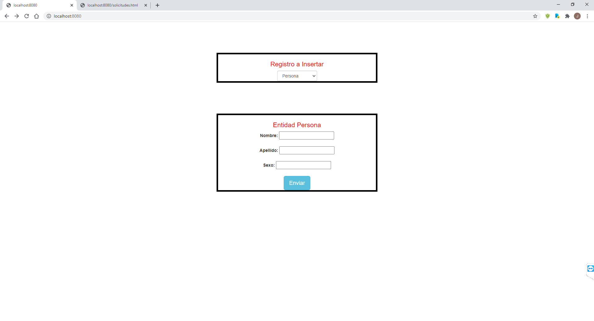
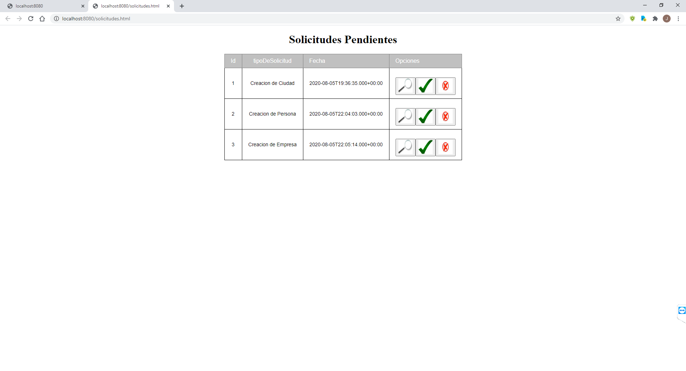

# prueba_DigiData

- Este es producto final de la prueba de DigiData en Colombia, programado en el BackEnd en lenguaje JAVA y en el FronEnd en HTML Estatico.
- La principal funcionalidad es recibir queries de usuarios, para la posible aceptacion por parte del administrador.
- Este producto corre bajo el servidor de SpringBoot.
- La base de datos es un servicio en la nube proporcionado por [Cloud MySql](https://freemysqlhosting.net) 

# Prerequisitos

Tener instalado Java jdk versiones 8+, Maven comandos y git

# Empezando

1. Ejecutar en terminal para instalar los paquetes base del proyecto:

```
$$ mvn package
```

2. Correr el proyecto desde cmd en la carpeta raiz del proyecto o si gusta desde el IDLE Netbeans versiones 8.2+:

```
$$ mvn spring-boot:run
```

3. Abra la aplicacion en su navegador en la siguiente ruta:

```
http://localhost:8080/
```

# Demostración

## Pagina Inicio

<p align="center">
    
</p>

## Pagina Solicitudes

<p align="center">
    
</p>